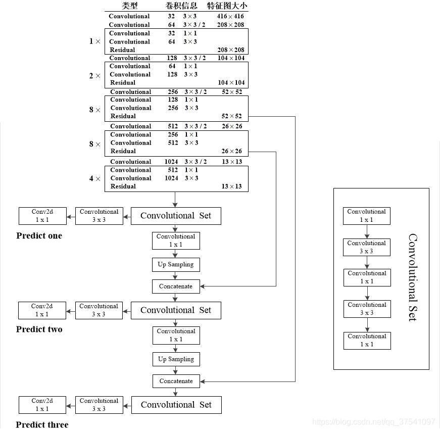
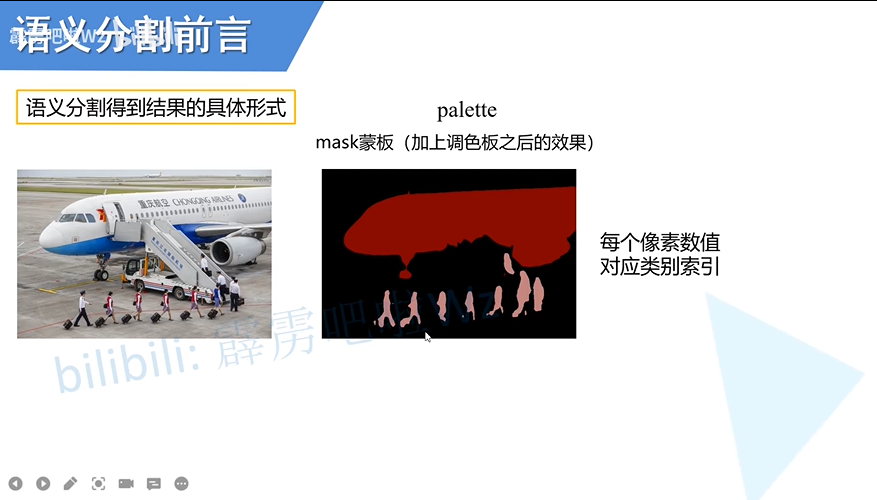
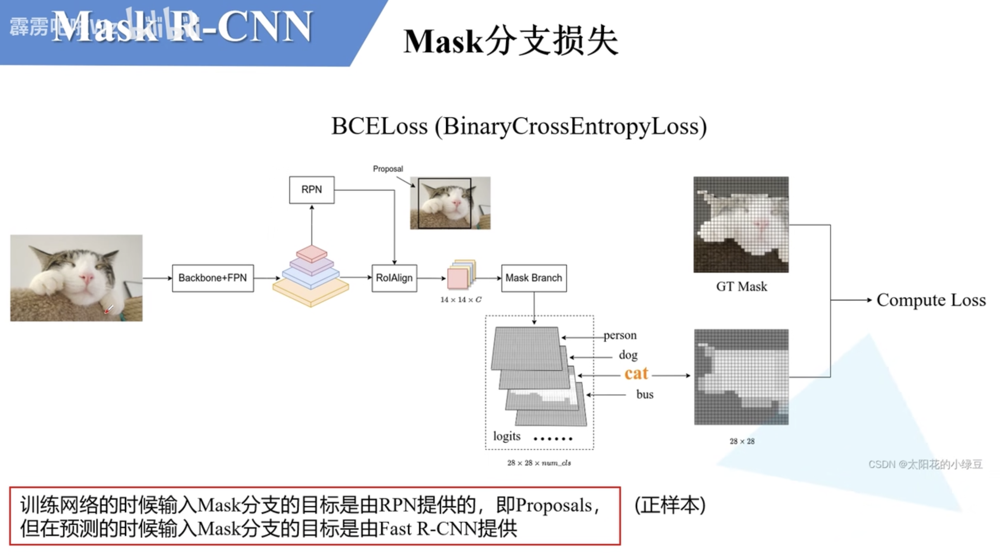

# pytorch classification

## LeNet 

### 亮点

CNN的雏形

### 结构


## AlexNet

### 亮点

* 首次使用GPU
* 使用ReLu
* 使用LRN局部响应归一化
* 在全连接层的前两层使用了Dropout随机失活神经元，以减少过拟合。

padding=int 上下左右

​				 tuple （a,b) 上下a, 左右b

nn.ZeroPad2d((1,2,1,2))


### 结构


## VGG

### 亮点

如下图

### 结构


## GoogLeNet

### 亮点

* 引入Inception结构（融合不同尺度的特征信息）
* 使用1x1的卷积核进行降维以及映射处理
* 添加两个辅助分类器帮助训练
* 丢弃全连接层，使用平均池化层（大大减少模型参数）


### 结构


## ResNet

### 亮点

* 超深的网络结构(>1000)
* 提出residual模块
* 使用Batch Normalization加速训练（丢弃Dropout)


首先，由于1.梯度消失or梯度爆炸； 2. 退化(degradation)问题； 

卷积层和池化层并不是越多越好

解决上述两个问题：

1. 数据标准化 权重初始化  BN
2. 残差的结构


### 结构


==注意每一种不同的Block在交接时，需要虚线处理下才能用==


常用的迁移学习方式：

* 载入权重后训练所有参数
* 载入权重后之训练最后几层参数
* 载入权重后在原网络基础上再添加一层全连接层，仅训练最后一层。


### ResNeXt


## MobileNet


### 亮点

+ Depthwise Convolution(大大减少运算量和参数数量)
+ 增加超参数α（控制卷积核个数）、β（控制图像的分辨率）

传统卷积：

+ kernel channel==input channel
+ kernel number==output channel

DW卷积：

+ kernel channel ==1
+ input channel == kernel number == output channel

Depthwise Separable Conv :

DW + PW (Pointwise Conv)

PW: 普通卷积核，大小为1


### 结构


==version1==


==version2==

亮点：

+ inverted residuals (倒残差结构)
+ linear bottlenecks


==version3==

亮点：

+ 更新block(bneck)
+ 使用NAS(neural architecture search)搜索参数
+ 重新设计耗时层机构

 


## ShuffuleNet


提出了channel shuffle 的思想

其中的unit 全是GConv和DWConv


==代码问题==

由于换了一个train.py，导致花费了很长时间。

尽管已经载入了迁移学习的参数，第一个epoch得到的准确率不会超过50%， 这和教学视频不符合。

用了以前的train.py不管是载入参数，还是无迁移学习训练，效果都不好，初始几个epoch的准确率在20+%，而且还上不去。

大概是model.py里没有initiate weights的问题。 估计Up把参数初始化放到他新改的函数步骤里了。

需要看train_with_multi_GPU这一集

明天改。


载入初始权重还是有错误，估计是model.py编写的时候出了什么问题。暂先放弃。


$\uparrow$绝对是自己写的model有问题 


## EfficientNet

### 亮点

==compound scaling: channels, layers and resolution    $\uparrow$==

似乎和mobilenet差不多。。。


### 结构


## EfficientNetV2


### 亮点

 

+ 引入Fused-MBConv模块
+ 引入渐进式学习策略（训练更快）


针对v1版本的问题：

+ 训练图像尺寸很大时，训练速度非常慢
+ 在网络浅层使用DWConv的速度会很慢
+ 同等的放大每个stage是次优的


==渐进式学习==


### 结构


## Vision Transformer

### 亮点

可能在于把NPL的模型拿来用了吧= =；

self-attention & multi-head self-attention的东西见笔记本

### 结构


==注意： 位置编码是一个跟token形状一样的Tensor(Vector?)，将二者按位置相加，最终得到进入Transformer Encoder的输入。==


==layer normalization 实际上和batch normalization 相似，只不过前者常用于NPL， 后者常用于image processing==


==整体结构框架==


## Swin-Transfomer

### 亮点

+ surpass all the previous state-of-the-art by a large margin(2~3)
+ 使用了W-MSA，减少计算量


关于这个计算量怎么来的： [ Swin-Transformer网络结构详解_swin transformer_太阳花的小绿豆的博客-CSDN博客](https://blog.csdn.net/qq_37541097/article/details/121119988)


+ S(Shifted)W-MSA，和W-MSA成对搭配使用，来实现window之间信息的交互

+ relative position


### 结构


#### Patch Merging


patch merging 起到将输入长宽减半，通道双倍的作用


#### 关于SW-MSA的问题：

偏移窗口后得到的划分块大小不一致：padding(块数增加会导致更多的计算量) or reconstruct（不相邻的小块现在组成一个大快，但彼此的q不需要对方的k）

reconstruct: masked-MSA    (大块里的小块qkv计算的时候会有另外一个小块，但与另一块的计算结果会-100，经过softmax就置为0了，等价于没和另一个小块交流)   （ps: 矩阵的加减在gpu看来都没啥计算量的）


#### relative position


==最后训练的是relative position bias table里的参数==


#### 参数


#### 代码的结构

| def              | class                |
| ---------------- | -------------------- |
| drop_path_f      | DropPath             |
| window_partition | PatchEmbed           |
| window_reverse   | PatchMerging         |
|                  | Mlp                  |
|                  | WindowAttention      |
|                  | SwinTransformerBlock |
|                  | BasicLayer           |
|                  | SwinTransformer      |


## ConvNeXt

### 亮点

transformer 的策略能否用在卷积神经网络里，让后者变得更为有效？

于是乎在以下方面做了探索

+ Macro design
+ ResNeXt
+ Inverted bottleneck
+ Large kernel size
+ Various layer-wise Micro designs


### 结构


## MobileViT

### 亮点

+ light-weight， general-purpose, mobile-friendly
+ pure Transfomer model  issues: 
  + 参数多，要求算力高
  + 缺少空间归纳偏置--->绝对位置，相对位置
  + 迁移到其他任务比较繁琐<--- 由位置编码导致的
  + 训练困难
+ 是cnn和transformer的混合


### 结构


这里做self-attention的时候，划分的格子也叫做patch。


# pytorch object detection

+ 评价指标

```
IoU metric: bbox
 Average Precision  (AP) @[ IoU=0.50:0.95 | area=   all | maxDets=100 ] = 0.322
 Average Precision  (AP) @[ IoU=0.50      | area=   all | maxDets=100 ] = 0.635
 Average Precision  (AP) @[ IoU=0.75      | area=   all | maxDets=100 ] = 0.289
 Average Precision  (AP) @[ IoU=0.50:0.95 | area= small | maxDets=100 ] = 0.040
 Average Precision  (AP) @[ IoU=0.50:0.95 | area=medium | maxDets=100 ] = 0.195
 Average Precision  (AP) @[ IoU=0.50:0.95 | area= large | maxDets=100 ] = 0.383
 Average Recall     (AR) @[ IoU=0.50:0.95 | area=   all | maxDets=  1 ] = 0.331
 Average Recall     (AR) @[ IoU=0.50:0.95 | area=   all | maxDets= 10 ] = 0.453
 Average Recall     (AR) @[ IoU=0.50:0.95 | area=   all | maxDets=100 ] = 0.461
 Average Recall     (AR) @[ IoU=0.50:0.95 | area= small | maxDets=100 ] = 0.113
 Average Recall     (AR) @[ IoU=0.50:0.95 | area=medium | maxDets=100 ] = 0.318
 Average Recall     (AR) @[ IoU=0.50:0.95 | area= large | maxDets=100 ] = 0.530
```


## Faster rcnn


## FPN

**feature pyramid networks**

注意fpn与其他的不同

+ a 为针对不同尺度的目标，将图片缩放，再去预测
+ b 为普通的特征提取流程，在最后一个特征层上预测
+ c 为在每一步特征提取的特征图上进行预测
+ d 与c的不同在于它做了不同尺度信息的特征融合，在每一步融合特征图上进行预测

**<font size=4>多个层的预测结果，最终都是映射回原图去表示结果</font>**


## ssd

+ faster rcnn的问题
  + 对小目标检测效果很差
  + 模型大，检测速度慢

### 整体思想

+ 设置Default Box(anchor)
  + scale和aspect组合形成4/6（k）种形状的anchor
  + 特征层的每一点都生成k个anchor
  + 假设有c个类别，对于mxn的特征图，要产生(c+4)kmn的输出。这里与faster rcnn不同的是位置参数，faster rcnn会为每个类别都预测4个位置参数，ssd则忽视类别，只输出4个位置参数。

+ 正负样本匹配（hard negtive mining)
  + 正样本取与gt box IoU最大的； 或IoU超过设定的阈值的
  + 负样本按照confidence loss 递减排序，按比例取前面的样本作为训练的负样本

+ 损失函数
  + 类别损失和定位损失
  + $L(x,c,l,g) = \frac{1}{N}(L_{conf}(x,c)+\alpha L_{loc}(x,l,g))$
  + 其中N是匹配的正样本个数，α为1


### 结构


## RetinaNet

$\star$ One-stage 首次超越Two-stage

主要是和FPN的一些不同

### 整体思想

**正样本匹配**

算anchor和gt box的iou

iou >= 0.5 --> 正样本

iou < 0.4 --> 负样本

iou处于二者之间的 --> 丢弃

**focal loss**

这篇论文主要介绍的就是focal loss
$$
Loss = \frac{1}{N_{pos}}\sum_{i}L_{cls}^{i}+ \frac{1}{N_{pos}}\sum_{j}L_{reg}^{j}
\\
\hline
L_{cls}:sigmoid\;facal\;loss\\
L_{reg}:L1\;loss\\
N_{pos}:正样本个数\\
i:所有的正负样本\\
j:所有正样本
$$


### 结构


## yolov1

### 整体思想

​	yolov1里没有生成anchor，而是通过grid cell直接预测两个box的坐标信息，这导致了模型mAP不理想。v2版本后便启用了生成anchor(bounding box prior)的思想。

​	简而言之，其他都是预测基于anchor的偏移参数，这个版本是直接预测物体的坐标。


+ 损失函数

$$
&\lambda_{coord}\sum_{i=0}^{S^{2}}\sum_{j=0}^{B}\mathbb{I}_{ij}^{obj}(x_{i}-\hat{x_{i}})^2+(y_{i}-\hat{y_{i}})^2+ \\
&\quad\quad\quad\quad\lambda_{coord}\sum_{i=0}^{S^{2}}\sum_{j=0}^{B}\mathbb{I}_{ij}^{obj}(\sqrt{w_{i}}-\sqrt{\hat{w_i}})^2+(\sqrt{h_{i}}-\sqrt{\hat{h_i}})^2+ \\
&\sum_{i=0}^{S^{2}}\sum_{j=0}^{B}\mathbb{I}_{ij}^{obj}(C_{i}-\hat{C_{i}})^{2}+ \\
&\lambda_{noobj}\sum_{i=0}^{S^{2}}\sum_{j=0}^{B}\mathbb{I}_{ij}^{obj}(C_{i}-\hat{C_{i}})^{2}+ \\
&\sum_{i=0}^{S^{2}}\mathbb{I}_{ij}^{obj}\sum_{c\in{classes}}{(p_{i}(c)-\hat{p_{i}}(c))^2}
$$


### 结构


+ 局限
  + 对群体小目标不理想
  + 目标在新的或者不寻常的尺寸配置下出现时，模型泛化弱
  + 定位不准确是主要误差来源


## yolov2

### 整体思想

在v1版本上做的各种尝试

+ Batch Normalization

+ High Resolution Classifier

+ Convolutional With Anchor Boxes

+ Dimension Clusters

+ Direct Location Prediction

  + 模型的不稳定来自于预测box的中心坐标(x,y)

  + 原先的坐标表达式		$x= (t_x*w_a)+x_a， y= (t_y*h_a)+y_a$

  + 现在的坐标表达式		$b_x= \sigma(t_x)+c_x,  b_y=\sigma(t_y)+c_y$

    ​									   $ b_w = p_we^{t_w},  b_h=p_he^{t_h}$

    ​									   $Pr(object)*IOU(b,object)= \sigma(t_o)$

     其中 $c_x,c_y$是grid cell左上角坐标，$a$是指anchor,  $p$是指bouding box prior, $t$是指   网络预测的偏移参数, $\sigma$是sigmoid函数。

+ Fine-Grained Features

  + 将低层特征和高层特征融合

  + passthrough layer (w/2, h/2, cx4)

     

+ Multi-Scale Training

  + 每10个batches训练后网络随机选择一个新尺寸来训练（尺寸是32的倍数）


### 结构

Backbone: Darknet-19


## yolov3

### 整体思想

一些缝缝补补罢了

+ 正负样本匹配

  + 论文版本： 每个gt box只取iou最大的bbox当正样本，超过一定阈值的丢弃，剩下都当负样本
  + Ultralytics版本
  + 

+ 损失函数
  $$
  L(o,c,O,C,l,g)= \lambda_1L_{conf}(o,c)+ \lambda_2L_{cla}(O,C)+\lambda_3L_{loc}(l,g)\\
  \lambda_1,  \lambda_2,  \lambda_3为平衡系数
  $$
  

  + 置信度损失(Binary Cross Entropy)

  $$
  L_{conf}(o,c)= -\frac{\sum_i(o_iln(\hat{c_i})+ (1-o_i)ln(1-\hat{c_i}))}{N}\\
  \\
  \hat{c_i}=Sigmoid(c_i)\\
  其中o_i\in[0,1]，表示预测目标边界框与真实目标边界框的IOU（存在出入）\\
  c_i为预测值，\hat{c_i}为c通过Sigmoid函数得到的预测置信度\\
  N为正负样本个数
  $$

  

  + 分类损失(Binary Cross Entropy)

  $$
  L_{cla}(O,C)=-\frac{\sum_{i\in pos}\sum_{j\in cla}(O_{ij}ln(\hat{C_{ij}})+(1-O_{ij})ln(1-\hat{C_{ij}}))}{N_{pos}}\\
  \\
  其中O_{ij}\in \{0,1\},表示预测 预测目标边界框i中是否存在第j类的目标\\
  C_{ij}为预测值，\hat{C_{ij}}为C_{ij}通过Sigmoid函数得到的预测置信度\\
  N_{pos}为正样本个数
  $$

  

  + 定位损失（Sum of Squared Loss）

  $$
  L_{loc}(t,g)=\frac{\sum_{i\in pos}(\sigma(t_{x}^{i}-\hat{g_{x}^{i}})^2)+(\sigma(t_{y}^{i}-\hat{g_{y}^{i}})^2+(t_{w}^{i}-\hat{g_{w}^{i}})^2)+(t_{h}^{i}-\hat{g_{h}^{i}})^2)}{N_{pos}}\\
  \\
  t 为网络预测的回归参数\\
  \hat{g}为真实回归参数\\
  g是gt\; box真实的中心和宽高\\
  \hat{g_{x}^{i}}= {g_{x}^{i}}-{c_{x}^{i}}\\
  \hat{g_{y}^{i}}= {g_{y}^{i}}-{c_{y}^{i}}\\
  \hat{g_{w}^{i}}= ln({g_{w}^{i}}/{p_{w}^{i}})\\
  \hat{g_{h}^{i}}= ln({g_{h}^{i}}/{p_{h}^{i}})
  $$

  

### 结构

Backbone: Darknet-53


完整框架： 




## yolov3 SPP

### 整体思想

在原本的v3加上了

+ Mosaic图像增强
  + 四张图片拼接变一张
    + 增加数据多样性
    + 增加目标个数
    + BN能一次性统计多张图片的参数
+ SPP模块 （spatial pyramid pooling）
+ CIOU Loss
+ ~~Focal Loss~~


#### IOU LOSS

从v3的L2变成：
$$
IoU\; loss = -ln\frac{Intersection(gt,pre)}{Union(gt, pre)} 
\\
or\\
IoU\; loss =1-\frac{Intersection(gt,pre)}{Union(gt, pre)}
$$
优点：

1. 能够更好反应重合程度
2. 具有尺度不变性

缺点：

1. 当不相交时始终为1，无法反映gt和pre的距离远近

#### GIOU


$$
GIoU = IoU - \frac{A^c-u}{A^c}\\
-1 \le GIoU \le 1\\
L_{GIoU} =1 - GIoU\\
0 \le L_{GIoU} \le 2\\
A^c是蓝色矩形框的面积\\
u是gt和pre的并集面积
$$


#### DIoU

+ 前二者 收敛慢，回归的不够准确


$$
DIoU = IoU - \frac{\rho^2(b,b^{gt})}{c^2} = IoU - \frac{d^2}{c^2}\\
-1 \le DIoU \le 1\\
L_{DIoU} =1 - DIoU\\
0 \le L_{DIoU} \le 2\\
$$

#### CIoU

+ 一个优秀的回归定位损失应考虑： 重叠面积， 中心点距离， 长宽比

$$
CIoU = IoU - (\frac{\rho^2(b,b^{gt})}{c^2} +\alpha\upsilon)
\\
\upsilon= \frac{4}{\pi^2}(arctan\frac{w^{gt}}{h_{gt}}- arctan\frac{w}{h})^2
\\
\alpha = \frac{\upsilon}{(1-IoU)+\upsilon}\\
L_{CIoU} = 1-CIoU
$$

#### Focal loss

+ 针对one-stage object detection model的class imbalance问题

$$
CE(p,y) = \begin{cases}-ln(p) & if\; y=1\\-ln(1-p) & otherwise.\end{cases}  \quad\quad\quad(1)\\
p_t = \begin{cases}p & if\; y=1\\1-p & otherwise.\end{cases}  \quad\quad\quad\quad\quad\;\;\quad\quad\quad(2)\\
\alpha_t = \begin{cases}\alpha & if\; y=1\\1-\alpha & otherwise.\end{cases}  \quad\quad\quad\quad\quad\;\;\quad\quad\quad(3)\\\\
CE(p_t) = -\alpha_tln(p_t)\quad\quad\quad\quad\quad\;\;\;\quad\quad\quad\quad\quad(4)\\
FL(p_t)=-(1-p_t)^\gamma ln(p_t)\quad\quad\quad\;\;\;\,\quad\quad\quad\quad(5)\\
FL(p_t)=-\alpha_t(1-p_t)^\gamma ln(p_t)\quad\quad\quad\;\quad\quad\quad\quad(6)\\
$$

$$
\\(6)为最终版
\\
\alpha和\gamma是超参数。 (1-p_t)^\gamma能够降低易分样本的损失贡献
$$


+ FL易受噪音感染


### 结构


## yolov4

### 整体思想 

+ Eliminate grid sensitivity
  + 给sigma函数引入缩放因子和常量，改变其值域，使得预测框的中心点落到grid边界线上的情况较容易达成（原先需要$t_x,t_y \rightarrow +\infty$）
  
  + $$
    b_x= \sigma(t_x)+c_x\\
    b_y=\sigma(t_y)+c_y\\
    -------------\\
    现改为\\
    b_x= (2\cdot\sigma(t_x)-0.5)+c_x\\
    b_y=(2\cdot\sigma(t_y)-0.5)+c_y\\
    $$
  
    ​							
  
+ Mosanic data augmentation

+ IoU threshold(match positive samples)
  + 
  
+ Optimizered anchors

+ CIoU

### 结构

+ backbone: CSPDARKNET53
+ Neck: SPP, PAN
  + PAN = FPN+Bottom-up path augmentation

+ Head: YOLOv3


## yolov5(v6.1)

### 整体思想

<font size=5>改动</font>

+ 将Foucs模块替换成了6x6的普通卷积层 （patch merge第一步的反向操作, 也可见YOLOv2的pass through layer）
+ SPP --> SPPF (结果一样，后者速度更快)


+ 数据增强
  + mosaic
  + copy paste  --- 但是必须要有实例分割的标注
  + random affine --- rotation, scale, translation, shear
  + mix up
  + albumentations 一个数据增强的包
  + HSV
  + random horizontal flip


+ 训练策略
  + Multi-scale training(0.5-1.5x)
  + AutoAnchor(For training custom data)
  + Warmup and Cosine LR scheduler
  + EMA(Exponential Moving Average)
  + Mixed precision
  + Evolve hyper-parameters
+ 平衡不同尺度损失
  + 针对三个预测特征层(P3,P4,P5)上的obj损失采用不同的权重

$$
L_{obj} = 4.0\cdot L_{obj}^{small}+ 1.0\cdot L_{obj}^{medium}+0.4\cdot L_{obj}^{large}
$$

+ 消除Grid敏感度

  + YOLOv4只修改了中心点的算法，v5中将box的长宽算法也改变了

  + $$
    b_w = p_we^{t_w}\\
    b_h=p_he^{t_h}\\
    -----------\\
    现改为\\
    b_w = p_w\cdot(2\cdot\sigma({t_w}))^2\\
    b_h=p_h\cdot(2\cdot\sigma({t_h}))^2
    $$

+ 匹配正样本


若$r^{max} < anchor\_t$，即为匹配成功。

### 结构

+ Backbone: New CSP-Darknet53
+ Neck: SPPF, New CSP-PAN
+ Head: YOLOv3 Head


## YOLOX

### 整体思想

$\star$1st Streaming Perception Challenge

+ Anchor-Free
+ decoupled detection head
  + 多个head间参数不共享

+ advanced label assgning strategy(SimOTA)
  + 由OTA(Optimal Transport Assignment)简化得到，将正负样本匹配的过程看作一个最优传输问题
  + 最小化将gt 分配给 anchor point的成本
  + $c_{ij} = L^{cls}_{ij}+\lambda L^{reg}_{ij}$
  + 并不是取所有点算cost，而是类似于fcos，先取gt box中的点，yolox另外设置一个fix center area（w/ 超参数center_radius=2.5)，落入gt box和fix center area交区域里的点cost较小，其他点cost较大
  + 源码$cost = (pair\_wise\_cls\_loss+3.0*pair\_wise\_ious\_loss+100000.0*(~is\_in\_boxes\_and\_center))$
  + 匹配流程
    + 构建anchor point与gt的cost矩阵和IoU矩阵
    + 根据IoU取前n_candidate_k个anchor point
    + 算gt对应anchor point个数：dynamic_ks=torch.clamp(topk_ious.sum(1).int(),min=1)--> 即求gt与之k个anchor point的IoU和
    + 每个gt根据其递增排序的cost取dynamic_ks个anchor point，将这些point标记为正样本，剩下的都是负样本
    + 若发生同一个anchor point匹配多个gt，取cost最小的gt作为它的配对


**位置预测的四个参数**


**损失计算**
$$
Loss = \frac{L_{cls}+\lambda L_{reg}+L_{obj}}{N_{pos}}\\
\\\hline\\
L_{obj}是IoU分支的损失\\
L_{cls}和L_{obj}都是BCELoss\\
\lambda在源码中设为5.0\\
N_{pos}代表被分为正样本的Anchor Point数\\
L_{cls}和L_{reg}只计算正样本的损失，L_{obj}正负样本损失都计算
$$


### 结构

基本跟YOLOv5: 5.0一样，唯一区别在于head


## FCOS

Fully Convolutional One-Stage Object Detection

### 整体思想

+ **Anchor-Free**
+ One-stage
+ FCN-base

针对一个预测点，直接预测l t r b四个参数

**<font size=4>Anchor-base网络的问题</font>**

+ 检测器的性能与Anchor的size和aspect ratio相关
+ 一般anchor的size和aspect ratio是固定的，在任务迁移时可能需要重新设计
+ 为了达到更高的recall，要生成密集的anchor，其中绝大部分都是负样本。正负样本极度不均匀
+ Anchor导致网络训练的繁琐

**What is center-ness?**

表示当前预测点距离目标中心的远近，由网络的一个分支预测，真实标签是由该点距真实标注框的lrtb计算得到
$$
centerness^{*} = \sqrt{\frac{min(l^{*},r^{*})}{max(l^{*},r^{*})}\cdot\frac{min(t^{*},b^{*})}{max(t^{*},b^{*})}}
$$
**正负样本匹配**

+ 落入到gt box中的点都视作正样本 --> 这些点的一部分作为正样本（效果更好）

+ sub-box的两角坐标（center sampling）$（c_x-rs,c_y-rs,c_x+rs,c_y+rs）$，s为特征图相较原图的步距，r为超参数


**Ambiguity问题**

一个点落入了多个gt box中，它负责预测哪个？--> 面积（area）最小的

+ 使用FPN结构
+ 在FPN基础上在采用center sampling匹配准则


**Assign objects to FPN**

将不同尺度的目标分配到不同特征图上
$$
如果特征图上的一点满足：\\
max(l^*,t^*,r^*,b^*)\le m_{i-1}\\
or\\
max(l^*,t^*,r^*,b^*)\ge m_i\\
它会被视作负样本
$$


**损失函数**
$$
L(\{p_{x,y}\},\{{t_{x,y}\},\{s_{x,y}}\}=
\frac{1}{N_{pos}}\sum_{x,y}L_{cls}(p_{x,y},c^{*}_{x,y})\\
\hspace{5cm}+\frac{1}{N_{pos}}\sum_{x,y}1_{\{c^{*}_{x,y}>0\}}L_{reg}(t_{x,y},t^{*}_{x,y})&\\
\hspace{5cm}+\frac{1}{N_{pos}}\sum_{x,y}1_{\{c^{*}_{x,y}>0\}}L_{ctrness}(s_{x,y},s^{*}_{x,y})
\\
\hline
\\
p_{x,y}表示特征图在点(x,y)处预测的每个类别的score\\
c^{*}_{x,y}表示...对应的真实类别标签\\
1_{\{c^{*}_{x,y}>0\}}，指示函数，要求真实标签\gt0（正样本）\\
t_{x,y}表示...预测的边界框信息\\
t^{*}_{x,y}...真实边界框信息\\
s_{x,y}...预测的centerness\\
s^{*}_{x,y}真实的centerness
$$

ps： 类别损失为带focal loss的BCE Loss，定位损失是GIoU Loss, centerness损失是BCE Loss　

**train a multi-class classifier or C binary classifier?**

----what is the difference?


### 结构


# pytorch segmentation

<font size=5>常见分割任务</font>

+ 语义分割(semantic segmentation)
+ 实例分割(instance segmentation)
+ 全景分割(panoramic segementation)


**都是是对图像中的每个点做预测**

**难度依次递增**

<font size=5>语义分割任务常见的数据集格式</font>

+ PASCAL VOC
  + PNG图片（P模式），通道数为1
  + 边缘和难以分割的部分用白色填充
+ MS COCO
  + 针对图像中的每一个目标都记录的是polygon坐标 --> 实例分割√
  + 使用这个数据集需要手动把polygon坐标解码成PNG图片 


<font size=5>语义分割得到结果的具体形式</font>

跟标签文件一样。。。。




<font size=5>常见语义分割评价指标</font>
$$
{Pixel\;Accuracy}_{(Global\,Acc)} = \frac{\sum_in_{ii}}{\sum_it_i}
\\
mean\;Accuracy = \frac{1}{n_{cls}}\cdot\sum_i\frac{n_{ii}}{t_i}
\\
mean\;IoU = \frac{1}{n_{cls}}\cdot\sum_i\frac{n_{ii}}{t_i+\sum_jn_{ji}-n_{ii}}
\\
————————————————————————\\
nij:类别i被预测成类别j的像素个数\\
n_{cls}:目标类别个数\\
t_i = \sum_{j}n_{ij}:目标类别i的总像素个数（真实标签）
$$
pytorch通过**混淆矩阵**来计算以上指标


<font size=5>标注工具</font>

[label me](https://github.com/wkentaro/labelme)

[ei seg](https://github.com/PaddlePaddle/PaddleSeg)


## 转置卷积（transposed convolution)

别名： ~~fractionally-strided convolution, deconvolution~~   不建议使用

作用： 基本是**upsample**

ps:

+ 转置卷积不是卷积的逆运算
+ 转置卷积也是卷积

[相关论文](https://arxiv.org/abs/1603.07285)

<font size=5>转置卷积操作步骤</font>

+ 在输入特征图元素间填充s-1行和列的0
+ 在输入特征图四周填充k-p-1行和列的0
+ 将卷积核参数上下、左右翻转
+ 做正常卷积运算（padding=0,  stride=1）

$$
Height_{out} = (H_{in}-1)\times stride[0] -2\times padding[0]+ kernel\_size[0]\\
Width_{out} = (W_{in}-1)\times stride[1] -2\times padding[1]+ kernel\_size[1]\\
\\
------------------------------\\
pytorch\;version\\
H_{out} = (H_{in}-1)\times stride[0] -2\times padding[0]+ dilation[0]\times (kernel\_size[0]-1)+output\_padding[0]+1\\
W_{out} = (W_{in}-1)\times stride[1] -2\times padding[1]+ dilation[1]\times (kernel\_size[1]-1)+output\_padding[1]+1\\
$$


## 膨胀卷积（dilated convolution）

别名： Atrous convolition 空洞卷积

+ 增大感受野
+ 保持原特征图的w,h(一般情况)

$\star$ 在特征提取网络中max pooling层会导致丢失细节信息和小目标，which 不能通过上采样还原，若简单粗暴地将max pooling去除，会导致感受野变小，影响后续卷积。因此需要dilated convolution 

$\star$ 在语义分割任务中也不能简单粗暴地堆叠dilated convonlution --> gridding effect --> solution: hybrid dilated convolution(HDC)

特征图尺寸（存疑🤔）
$$
H_{out} = \frac{H_{in}-(kernel\_size-1)\times dilation\_rate-1+2\times padding}{stride} + 1
$$


**HDC**

+ 假设有N个尺寸为KxK卷积层，膨胀系数依次为[$r_1,...r_i,...r_n$]，目标是使得经过一系列卷积操作的结果的感受野能够完全地覆盖一个方形区域，没有任何的空洞或丢失边缘
+ maximum distance between two nonzero values，$M_i$ 代表第i层的两个非零值之间的最大距离 ---- 两个非零元素紧挨时，距离为1
+ $$make:\\M_i&=&max[M_{i+1}-2r_i, 2r_i-M_{i+1}, r_i]\\M_n&=&r_n\\\hline\\design\:goal: let\quad M_2\le K$$
  + r = []，总是从1开始的 --- 确保在第一步就不会出现孔洞
  + 将r设置成锯齿形状 e.g. [1,2,3,1,2,3]
  + r的元素们，公约数不能大于1(此点存疑🤔)


<center>Fig1: dilated convolution</center>


<center>Fig2: gridding effect(same dc stacking)</center>


<center>Fig3: how to avoid missing message through dilation rate design


<center>Fig4: vanila convolution stacking</center>


## FCN

Fully  Convolutional Networks for Semantic Segmentation

首个端对端的针对像素级预测的全卷积网络

非常经典

2015

### 整体思想

+ 21是PASCAL VOC的目标类别（20）+背景
+ 将普通的分类网络最后的全连接层换成卷积层，这样可以输入任意尺寸的图片
+ 损失计算
  + 对每一个pixel求cross entropy loss，再求平均


### 结构

FCN-32S

FCN-16S

FCN-8S： 效果最好

因为在语义分割网络中，下采样倍率过大，在最后通过upsample回到原尺度的时候比较困难。


## DeepLabV1

### 整体思想

**语义分割任务中存在的两个问题**

其实是分类网络的特点

+ signal downsampling      --> 下采样损害图像分辨率
+ spatial insensitivity (invarience)   --> 对于语义分割任务，图片的轻微变化都能影响结果，但是网络对这种变化不敏感

**解决方法**（和上面两个问题对应）

+ dilated convolution  --> 解决downsampling的问题
+ fully-connected CRF (Conditional Random Field)  -->在v3版本中已经不使用了--> 解决spatial insensitivity的问题

**网络优势**

+ 速度更快，因为膨胀卷积，但是fully-connected CRFs很耗时
+ 准确率更高，比之前SOTA提升7.2点
+ 模型结构简单，主要由DCNNs和CRFs级联组成


**MSc**

Multi-Scale

将最原始图片和网络中的maxpool输出与最后的输出作add融合（相当于在主分支之外另开了另外5个分支）见Fig1


**CRF**

gpt： 全连接CRF是一种概率图模型，考虑了一元势能（与单个像素相关的信息）和成对势能（成对像素之间的相互作用）对图像中所有像素对的影响。这使得该模型能够捕捉复杂的空间依赖关系，提高诸如语义分割之类的任务的准确性，其中的目标是为图像中的每个像素分配一个类别标签。


**LargeFOV**

FOV == Field of View

+ 降低模型参数
+ 提升训练速度

将全卷积网络中的大卷积转换成小的膨胀卷积


<center>*表中的input size指的是dilation</center>
<center>且最后一行使用的卷积核个数是1024而不是4096 rate</center>

### 结构

[参考博客](https://img-blog.csdnimg.cn/cdcf41531d904956acf93ebb0ffdca77.png?x-oss-process=image/watermark,type_d3F5LXplbmhlaQ,shadow_50,text_Q1NETiBA5aSq6Ziz6Iqx55qE5bCP57u_6LGG,size_20,color_FFFFFF,t_70,g_se,x_16#pic_center)


<center>Fig1: 带有MSc结构的DeepLabV1
</center>

## DeepLabV2

### 整体思想

除了v1中提到了两个问题，还有**目标多尺度**的问题

+ 换了backbone --> resnet
+ 引入特殊结构解决目标多尺度问题 --> ASPP (atrous spatial pyramid pooling)

**ASPP**

把SPP里的maxpool全换成atrous convolution

**poly** 

learning rate policy
$$
&lr \times (1-\frac{iter}{max\_iter})^{power}
\\
&power=0.9
$$


<center>Fig1: ASPP结构</center>


<center>Fig2: Ablation Study (写论文可以参考)

### 结构

[参考博客](https://img-blog.csdnimg.cn/e5ae0a9d8efc4d48a4325a5620b2410b.png?x-oss-process=image/watermark,type_d3F5LXplbmhlaQ,shadow_50,text_Q1NETiBA5aSq6Ziz6Iqx55qE5bCP57u_6LGG,size_20,color_FFFFFF,t_70,g_se,x_16#pic_center)


## DeepLabV3

### 整体思想

在v2的基础上

+ 引入了Multi-grid
+ 改进ASPP结构
+ 移除CRFs后处理

**获取多尺度上下文的可选架构**

 

**ASPP改进**


**Multi-grid**

给使用膨胀卷积的残差结构设置膨胀系数


**Ablation Study**


**训练细节**

v3较v2提升了6个点

+ larger crop size
+ upsampling logits during training --- 在v1 v2中损失都是原图下采样8倍后和结果比较的，v3是将结果上采样跟原图比较的
+ fine-tuning batch normalization --- 在训练完成时冻结BN层，再继续fine-tuning其他参数

### 结构


pytorch version inplementation (slightly different) 

+ 没有使用Multi-grid
+ 添加了辅助分支FCNhead，可选择不使用
+ 训练图片和验证图片的下采样stride都是8
+ ASPP的三个膨胀卷积系数为12，24，36


## LR-ASPP

### 整体思想

在mobilenetv3论文提出

轻量级，适合移动端部署

### 结构


## UNet

### 整体思想

生物医学影像

对于高分辨率的大图像，如果一整张输入进行训练可能显存不够用，所以每回只去分割图片的一小块区域

分割时注意设置overlap，使得边界被更好的分割


**原论文中的问题**

+ 输出只是输入的中心部分，对于边缘部分的预测会缺少数据，论文中采用镜像的办法补充缺失
+ 原论文希望紧挨细胞间的分割效果比较好，所以给紧挨细胞边界的像素赋予更大的权重（pixel-wise loss weight） $\bigstar$ how to implement on code?


**dice similarity coefficient**

用来度量两个集合的相似性
$$
Dice = \frac{2|X\cap Y|}{|X|+Y|}\\
Dice\,Loss = 1-\frac{2|X\cap Y|}{|X|+Y|}
$$
 对于语义分割


### 结构


主流的实现代码会

+ 加padding，使得特征图经3x3卷积处理后高宽不变
+ 在relu后加bn层


## U2Net

$u^2-Net$

$\star$ SOD任务（salient object detection) 

显著性目标检测

 只有前景和背景两个类别 --- 二分类任务

### 整体思想

网络整体架构是u形，网络的基本组件(residual u-block)也是u形

+ 损失计算

  + $$
    L = \sum_{m=1}^{M}w_{side}^{(m)}\:l_{side}^{(m)}+w_{fuse}\:l_{fuse}\\
    \hline
    l代表二值交叉熵损失\\
    w代表每个损失的权重
    $$

+ 

+ 评价指标

  + PR-curve

  + F-measure

    + $$
      F_{\beta}= \frac{(1+\beta^2)\times precision\times Recall}{\beta^2\times Precision + Recall}\quad\in(0,1)\\
      数值越大越好
      $$

    + 由于Precision和Recall一般是在不同置信度下求得的，所以$F_\beta$取一组中的最大值

  + MAE (MeanAbsolute Error )

    + $$
      MAE= \frac{1}{H\times W}\sum_{r=1}^H\sum_{c=1}^W|P(r,c)-G(r,c)|\quad\in[0,1]\\数值越小越好
      $$

      

  + weighted F-measure

  + S-measure

  + relax boundary -measure

+ DUTS数据集

http://saliencydetection.net/duts/download/DUTS-TR.zip

http://saliencydetection.net/duts/download/DUTS-TE.zip

### 结构

En_1 --En_4以及对应的De_i 分别是RSU-{7-4}

En_5, En_6和De_5是RSU-4F


<center>Fig1: 整体</center>


<center>Fig2: residual u-block</center>


<center>Fig3: RSU-4F</center>


<center>Fig4: saliency map fusion module</center>


<center>Fig5： 各种参数</center>


## Mask-R-CNN

$\bigstar$ **Instance segmentation**

$\bigstar$ Object detection

$\bigstar$ Keypoint check

### 整体思想

+ 与Faster-Rcnn
  + faster rcnn 的3部分，经过特征提取网络后并联着rpn和fast rcnn
  + 现在经过roi pooling(roi align)后，并联一个mask rcnn的分支


+ RoIAlign
  + RoIPooling的两次取整操作会导致misalignment问题
    + 原图目标位置映射到特征层目标位置-->第一次取整
    + 特征图目标再下采样-->第二次取整
  + RoIAlign没有取整操作
    + 映射没有取整，左上和右下坐标（带有小数）直接映射到特征图
    + 下采样则通过设置采样倍率（samping ratio)，选取邻近的倍率平方个点，双线性插值算出输出
    + 作者提到最终采样结果对采样点位置和采样点个数并不敏感
+ Mask分支（FCN）

  + 训练： 输入是RPN提供的，即Proposal（正样本）
  + 预测：输入是fast rcnn提供的，即proposal经过回归预测+nms过滤后，最终呈现在图上的目标检测结果
  + mask和class是解耦的。分支最终的结果是28x28xnum_class形状的，一般情况下会将结果在channel维度上进行softmax，这样不同类别的概率总和为1，即它们存在竞争关系。但Mask分支最终没有softmax(使用的是sigmoid），根据fast rcnn的预测类别，将mask结果在通道上对应该类别的结果提取出来（28x28x1）

  
+ 损失

$$
Loss = L_{rpn}+L_{fast\_rcnn}+L{mask}\\
$$




### 结构


