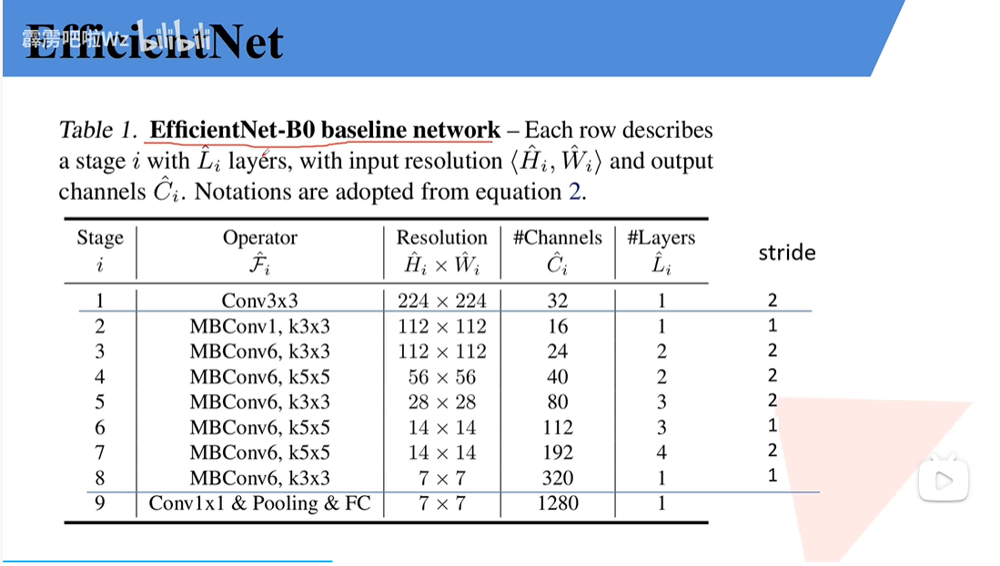
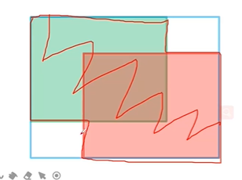

# pytorch classification

## LeNet 

### 亮点

CNN的雏形

### 结构


## AlexNet

### 亮点

* 首次使用GPU
* 使用ReLu
* 使用LRN局部响应归一化
* 在全连接层的前两层使用了Dropout随机失活神经元，以减少过拟合。

padding=int 上下左右

​				 tuple （a,b) 上下a, 左右b

nn.ZeroPad2d((1,2,1,2))


### 结构


## VGG

### 亮点

如下图

### 结构


## GoogLeNet

### 亮点

* 引入Inception结构（融合不同尺度的特征信息）
* 使用1x1的卷积核进行降维以及映射处理
* 添加两个辅助分类器帮助训练
* 丢弃全连接层，使用平均池化层（大大减少模型参数）


### 结构


## ResNet

### 亮点

* 超深的网络结构(>1000)
* 提出residual模块
* 使用Batch Normalization加速训练（丢弃Dropout)


首先，由于1.梯度消失or梯度爆炸； 2. 退化(degradation)问题； 

卷积层和池化层并不是越多越好

解决上述两个问题：

1. 数据标准化 权重初始化  BN
2. 残差的结构


### 结构


==注意每一种不同的Block在交接时，需要虚线处理下才能用==


常用的迁移学习方式：

* 载入权重后训练所有参数
* 载入权重后之训练最后几层参数
* 载入权重后在原网络基础上再添加一层全连接层，仅训练最后一层。


### ResNeXt


## MobileNet


### 亮点

+ Depthwise Convolution(大大减少运算量和参数数量)
+ 增加超参数α（控制卷积核个数）、β（控制图像的分辨率）

传统卷积：

+ kernel channel==input channel
+ kernel number==output channel

DW卷积：

+ kernel channel ==1
+ input channel == kernel number == output channel

Depthwise Separable Conv :

DW + PW (Pointwise Conv)

PW: 普通卷积核，大小为1


### 结构


==version1==


==version2==

亮点：

+ inverted residuals (倒残差结构)
+ linear bottlenecks


==version3==

亮点：

+ 更新block(bneck)
+ 使用NAS(neural architecture search)搜索参数
+ 重新设计耗时层机构

 


## ShuffuleNet


提出了channel shuffle 的思想

其中的unit 全是GConv和DWConv


==代码问题==

由于换了一个train.py，导致花费了很长时间。

尽管已经载入了迁移学习的参数，第一个epoch得到的准确率不会超过50%， 这和教学视频不符合。

用了以前的train.py不管是载入参数，还是无迁移学习训练，效果都不好，初始几个epoch的准确率在20+%，而且还上不去。

大概是model.py里没有initiate weights的问题。 估计Up把参数初始化放到他新改的函数步骤里了。

需要看train_with_multi_GPU这一集

明天改。


载入初始权重还是有错误，估计是model.py编写的时候出了什么问题。暂先放弃。


$\uparrow$绝对是自己写的model有问题 


## EfficientNet

### 亮点

==compound scaling: channels, layers and resolution    $\uparrow$==

似乎和mobilenet差不多。。。


### 结构





## EfficientNetV2


### 亮点

 

+ 引入Fused-MBConv模块
+ 引入渐进式学习策略（训练更快）


针对v1版本的问题：

+ 训练图像尺寸很大时，训练速度非常慢
+ 在网络浅层使用DWConv的速度会很慢
+ 同等的放大每个stage是次优的


==渐进式学习==


### 结构


## Vision Transformer

### 亮点

可能在于把NPL的模型拿来用了吧= =；

self-attention & multi-head self-attention的东西见笔记本

### 结构


==注意： 位置编码是一个跟token形状一样的Tensor(Vector?)，将二者按位置相加，最终得到进入Transformer Encoder的输入。==


==layer normalization 实际上和batch normalization 相似，只不过前者常用于NPL， 后者常用于image processing==


==整体结构框架==


## Swin-Transfomer

### 亮点

+ surpass all the previous state-of-the-art by a large margin(2~3)
+ 使用了W-MSA，减少计算量


关于这个计算量怎么来的： [ Swin-Transformer网络结构详解_swin transformer_太阳花的小绿豆的博客-CSDN博客](https://blog.csdn.net/qq_37541097/article/details/121119988)


+ S(Shifted)W-MSA，和W-MSA成对搭配使用，来实现window之间信息的交互

+ relative position


### 结构


#### Patch Merging


patch merging 起到将输入长宽减半，通道双倍的作用


#### 关于SW-MSA的问题：

偏移窗口后得到的划分块大小不一致：padding(块数增加会导致更多的计算量) or reconstruct（不相邻的小块现在组成一个大快，但彼此的q不需要对方的k）

reconstruct: masked-MSA    (大块里的小块qkv计算的时候会有另外一个小块，但与另一块的计算结果会-100，经过softmax就置为0了，等价于没和另一个小块交流)   （ps: 矩阵的加减在gpu看来都没啥计算量的）


#### relative position


==最后训练的是relative position bias table里的参数==


#### 参数


#### 代码的结构

| def              | class                |
| ---------------- | -------------------- |
| drop_path_f      | DropPath             |
| window_partition | PatchEmbed           |
| window_reverse   | PatchMerging         |
|                  | Mlp                  |
|                  | WindowAttention      |
|                  | SwinTransformerBlock |
|                  | BasicLayer           |
|                  | SwinTransformer      |


## ConvNeXt

### 亮点

transformer 的策略能否用在卷积神经网络里，让后者变得更为有效？

于是乎在以下方面做了探索

+ Macro design
+ ResNeXt
+ Inverted bottleneck
+ Large kernel size
+ Various layer-wise Micro designs


### 结构


## MobileViT

### 亮点

+ light-weight， general-purpose, mobile-friendly
+ pure Transfomer model  issues: 
  + 参数多，要求算力高
  + 缺少空间归纳偏置--->绝对位置，相对位置
  + 迁移到其他任务比较繁琐<--- 由位置编码导致的
  + 训练困难
+ 是cnn和transformer的混合


### 结构


这里做self-attention的时候，划分的格子也叫做patch。


# pytorch object detection

+ 评价指标

```
IoU metric: bbox
 Average Precision  (AP) @[ IoU=0.50:0.95 | area=   all | maxDets=100 ] = 0.322
 Average Precision  (AP) @[ IoU=0.50      | area=   all | maxDets=100 ] = 0.635
 Average Precision  (AP) @[ IoU=0.75      | area=   all | maxDets=100 ] = 0.289
 Average Precision  (AP) @[ IoU=0.50:0.95 | area= small | maxDets=100 ] = 0.040
 Average Precision  (AP) @[ IoU=0.50:0.95 | area=medium | maxDets=100 ] = 0.195
 Average Precision  (AP) @[ IoU=0.50:0.95 | area= large | maxDets=100 ] = 0.383
 Average Recall     (AR) @[ IoU=0.50:0.95 | area=   all | maxDets=  1 ] = 0.331
 Average Recall     (AR) @[ IoU=0.50:0.95 | area=   all | maxDets= 10 ] = 0.453
 Average Recall     (AR) @[ IoU=0.50:0.95 | area=   all | maxDets=100 ] = 0.461
 Average Recall     (AR) @[ IoU=0.50:0.95 | area= small | maxDets=100 ] = 0.113
 Average Recall     (AR) @[ IoU=0.50:0.95 | area=medium | maxDets=100 ] = 0.318
 Average Recall     (AR) @[ IoU=0.50:0.95 | area= large | maxDets=100 ] = 0.530
```


## ssd

+ faster rcnn的问题
  + 对小目标检测效果很差
  + 模型大，检测速度慢

### 整体思想

+ 正负样本匹配（hard negtive mining)
+ 


### 结构


## yolov1

### 整体思想

​	yolov1里没有生成anchor，而是通过grid cell直接预测两个box的坐标信息，这导致了模型mAP不理想。v2版本后便启用了生成anchor(bounding box prior)的思想。

​	简而言之，其他都是预测基于anchor的偏移参数，这个版本是直接预测物体的坐标。


+ 损失函数

$$
&\lambda_{coord}\sum_{i=0}^{S^{2}}\sum_{j=0}^{B}\mathbb{I}_{ij}^{obj}(x_{i}-\hat{x_{i}})^2+(y_{i}-\hat{y_{i}})^2+ \\
&\quad\quad\quad\quad\lambda_{coord}\sum_{i=0}^{S^{2}}\sum_{j=0}^{B}\mathbb{I}_{ij}^{obj}(\sqrt{w_{i}}-\sqrt{\hat{w_i}})^2+(\sqrt{h_{i}}-\sqrt{\hat{h_i}})^2+ \\
&\sum_{i=0}^{S^{2}}\sum_{j=0}^{B}\mathbb{I}_{ij}^{obj}(C_{i}-\hat{C_{i}})^{2}+ \\
&\lambda_{noobj}\sum_{i=0}^{S^{2}}\sum_{j=0}^{B}\mathbb{I}_{ij}^{obj}(C_{i}-\hat{C_{i}})^{2}+ \\
&\sum_{i=0}^{S^{2}}\mathbb{I}_{ij}^{obj}\sum_{c\in{classes}}{(p_{i}(c)-\hat{p_{i}}(c))^2}
$$


### 结构


+ 局限
  + 对群体小目标不理想
  + 目标在新的或者不寻常的尺寸配置下出现时，模型泛化弱
  + 定位不准确是主要误差来源


## yolov2

### 整体思想

在v1版本上做的各种尝试

+ Batch Normalization

+ High Resolution Classifier

+ Convolutional With Anchor Boxes

+ Dimension Clusters

+ Direct Location Prediction

  + 模型的不稳定来自于预测box的中心坐标(x,y)

  + 原先的坐标表达式		$x= (t_x*w_a)+x_a， y= (t_y*h_a)+y_a$

  + 现在的坐标表达式		$b_x= \sigma(t_x)+c_x,  b_y=\sigma(t_y)+c_y$

    ​									   $ b_w = p_we^{t_w},  b_h=p_he^{t_h}$

    ​									   $Pr(object)*IOU(b,object)= \sigma(t_o)$

     其中 $c_x,c_y$是grid cell左上角坐标，$a$是指anchor,  $p$是指bouding box prior, $t$是指   网络预测的偏移参数, $\sigma$是sigmoid函数。

+ Fine-Grained Features

  + 将低层特征和高层特征融合

  + passthrough layer (w/2, h/2, cx4)

     

+ Multi-Scale Training

  + 每10个batches训练后网络随机选择一个新尺寸来训练（尺寸是32的倍数）


### 结构

Backbone: Darknet-19


## yolov3

### 整体思想

一些缝缝补补罢了

+ 正负样本匹配

  + 论文版本： 每个gt box只取iou最大的bbox当正样本，超过一定阈值的丢弃，剩下都当负样本
  + Ultralytics版本
  + 

+ 损失函数
  $$
  L(o,c,O,C,l,g)= \lambda_1L_{conf}(o,c)+ \lambda_2L_{cla}(O,C)+\lambda_3L_{loc}(l,g)\\
  \lambda_1,  \lambda_2,  \lambda_3为平衡系数
  $$
  

  + 置信度损失(Binary Cross Entropy)

  $$
  L_{conf}(o,c)= -\frac{\sum_i(o_iln(\hat{c_i})+ (1-o_i)ln(1-\hat{c_i}))}{N}\\
  \\
  \hat{c_i}=Sigmoid(c_i)\\
  其中o_i\in[0,1]，表示预测目标边界框与真实目标边界框的IOU（存在出入）\\
  c_i为预测值，\hat{c_i}为c通过Sigmoid函数得到的预测置信度\\
  N为正负样本个数
  $$

  

  + 分类损失(Binary Cross Entropy)

  $$
  L_{cla}(O,C)=-\frac{\sum_{i\in pos}\sum_{j\in cla}(O_{ij}ln(\hat{C_{ij}})+(1-O_{ij})ln(1-\hat{C_{ij}}))}{N_{pos}}\\
  \\
  其中O_{ij}\in \{0,1\},表示预测 预测目标边界框i中是否存在第j类的目标\\
  C_{ij}为预测值，\hat{C_{ij}}为C_{ij}通过Sigmoid函数得到的预测置信度\\
  N_{pos}为正样本个数
  $$

  

  + 定位损失（Sum of Squared Loss）

  $$
  L_{loc}(t,g)=\frac{\sum_{i\in pos}(\sigma(t_{x}^{i}-\hat{g_{x}^{i}})^2)+(\sigma(t_{y}^{i}-\hat{g_{y}^{i}})^2+(t_{w}^{i}-\hat{g_{w}^{i}})^2)+(t_{h}^{i}-\hat{g_{h}^{i}})^2)}{N_{pos}}\\
  \\
  t 为网络预测的回归参数\\
  \hat{g}为真实回归参数\\
  g是gt\; box真实的中心和宽高\\
  \hat{g_{x}^{i}}= {g_{x}^{i}}-{c_{x}^{i}}\\
  \hat{g_{y}^{i}}= {g_{y}^{i}}-{c_{y}^{i}}\\
  \hat{g_{w}^{i}}= ln({g_{w}^{i}}/{p_{w}^{i}})\\
  \hat{g_{h}^{i}}= ln({g_{h}^{i}}/{p_{h}^{i}})
  $$

  

### 结构

Backbone: Darknet-53


完整框架： 


## yolov3 SPP

### 整体思想

在原本的v3加上了

+ Mosaic图像增强
  + 四张图片拼接变一张
    + 增加数据多样性
    + 增加目标个数
    + BN能一次性统计多张图片的参数
+ SPP模块
+ CIOU Loss
+ ~~Focal Loss~~


#### IOU LOSS

从v3的L2变成：
$$
IoU\; loss = -ln\frac{Intersection(gt,pre)}{Union(gt, pre)} 
\\
or\\
IoU\; loss =1-\frac{Intersection(gt,pre)}{Union(gt, pre)}
$$
优点：

1. 能够更好反应重合程度
2. 具有尺度不变性

缺点：

1. 当不相交时始终为1，无法反映gt和pre的距离远近

#### GIOU




$$
GIoU = IoU - \frac{A^c-u}{A^c}\\
-1 \le GIoU \le 1\\
L_{GIoU} =1 - GIoU\\
0 \le L_{GIoU} \le 2\\
A^c是蓝色矩形框买面积\\
u是gt和pre的并集面积
$$


#### DIoU

+ 前二者 收敛慢，回归的不够准确


$$
DIoU = IoU - \frac{\rho^2(b,b^{gt})}{c^2} = IoU - \frac{d^2}{c^2}\\
-1 \le DIoU \le 1\\
L_{DIoU} =1 - DIoU\\
0 \le L_{DIoU} \le 2\\
$$

#### CIoU

+ 一个优秀的回归定位损失应考虑： 重叠面积， 中心点距离， 长宽比

$$
CIoU = IoU - (\frac{\rho^2(b,b^{gt})}{c^2} +\alpha\upsilon)
\\
\upsilon= \frac{4}{\pi^2}(arctan\frac{w^{gt}}{h_{gt}}- arctan\frac{w}{h})^2
\\
\alpha = \frac{\upsilon}{(1-IoU)+\upsilon}\\
L_{CIoU} = 1-CIoU
$$

#### Focal loss

+ 针对one-stage object detection model的class imbalance问题

$$
CE(p,y) = \begin{cases}-ln(p) & if\; y=1\\-ln(1-p) & otherwise.\end{cases}  \quad\quad\quad(1)\\
p_t = \begin{cases}p & if\; y=1\\1-p & otherwise.\end{cases}  \quad\quad\quad\quad\quad\;\;\quad\quad\quad(2)\\
\alpha_t = \begin{cases}\alpha & if\; y=1\\1-\alpha & otherwise.\end{cases}  \quad\quad\quad\quad\quad\;\;\quad\quad\quad(3)\\\\
CE(p_t) = -\alpha_tln(p_t)\quad\quad\quad\quad\quad\;\;\;\quad\quad\quad\quad\quad(4)\\
FL(p_t)=-(1-p_t)^\gamma ln(p_t)\quad\quad\quad\;\;\;\,\quad\quad\quad\quad(5)\\
FL(p_t)=-\alpha_t(1-p_t)^\gamma ln(p_t)\quad\quad\quad\;\quad\quad\quad\quad(6)\\
$$

$$
\\(6)为最终版
\\
\alpha和\gamma是超参数。 (1-p_t)^\gamma能够降低易分样本的损失贡献
$$


+ FL易受噪音感染


### 结构


